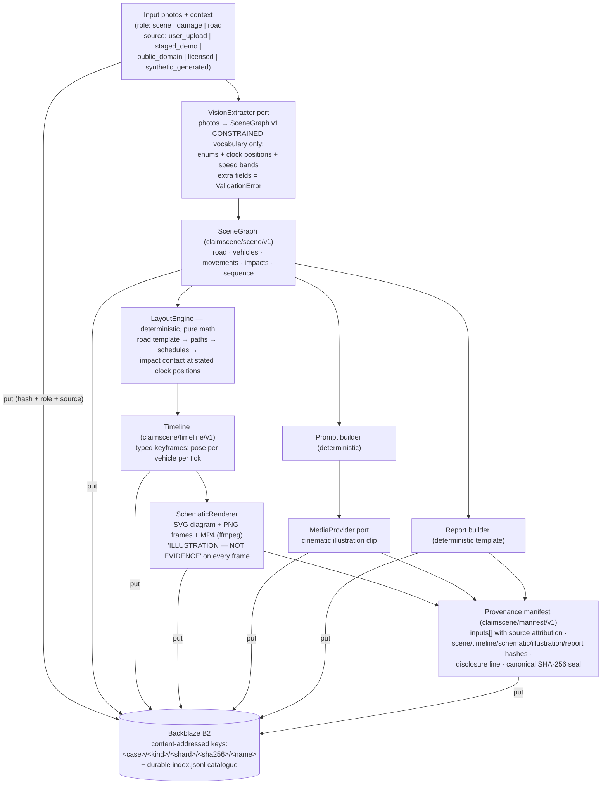
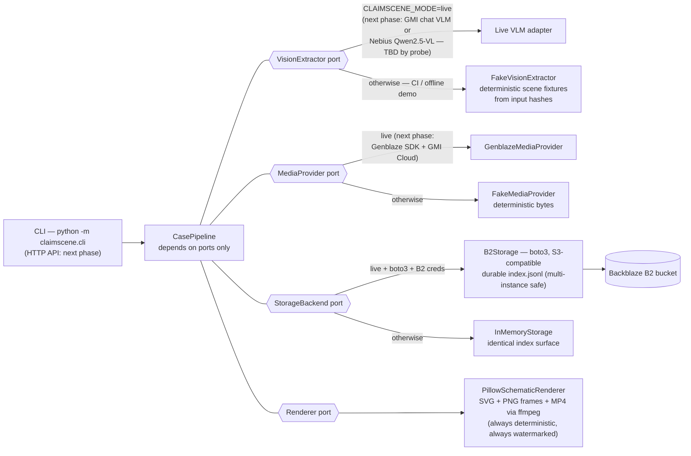

# ClaimScene

**Honest accident documentation & illustration.** Photos of an accident go in.
Out comes a constrained scene description, a deterministic top-down schematic,
a cinematic AI illustration that is explicitly sealed as *"AI-generated
illustration — not evidence"*, and an incident report. Every artifact is
content-addressed on Backblaze B2 with SHA-256-sealed provenance that also
records where every input photo came from.

Built for the **Backblaze Generative Media Hackathon** (provenance-aware media
category).

## The thesis

Incumbent accident-reconstruction tools sell precision they cannot prove.
ClaimScene sells the opposite: honest, self-disclosing illustration. As courts
and insurers tighten rules on AI-generated imagery in claims and evidence,
media that cannot say what it is becomes a liability. So ClaimScene splits
every case into two layers and never lets them blur:

1. **The factual layer.** A vision model may only fill a closed vocabulary
   (enums, clock positions, speed *bands* — never coordinates). Deterministic
   code turns that into geometry, an animated schematic, and a report. Same
   input, same bytes, every time.
2. **The illustration layer.** A generative video clip, watermarked in its
   prompt and sealed in the manifest as an illustration. The `degraded` flag
   honestly records whether a real provider generated it.

A tamper-evident manifest chains both layers, every input photo (with its
`source`, `attribution`, and `license`), and every hash. Re-badge a licensed
photo as a user upload and verification fails.

## Pipeline



## Architecture (ports and adapters)



The orchestrator depends only on ports. The fakes implement the same
protocols with no network, so the whole pipeline — including real SHA-256
provenance — runs offline in CI with zero credentials. In `live` mode a
missing credential degrades that backend to its fake with a WARNING and the
manifest honestly records `degraded: true`. It never crashes.

## Quickstart (offline, no credentials, ~2 minutes)

```bash
git clone https://github.com/upgradedev/claimscene.git
cd claimscene
python -m venv .venv
# Windows: .venv\Scripts\activate    Linux/macOS: source .venv/bin/activate
pip install -r requirements-dev.txt
pip install -e .

pytest                          # 108 offline tests
python -m claimscene.cli --case demo --out out
```

The CLI generates three synthetic demo photos (no photo directory needed),
runs the full pipeline, writes `out/demo/` (scene.json, timeline.json,
schematic.svg, schematic.png, schematic.mp4 when ffmpeg is on PATH,
illustration.mp4, report.md, manifest.json, index.jsonl), and prints a
per-artifact SHA-256 verification ending in `VERIFY: PASS`.

To use your own staged photos: `python -m claimscene.cli --case demo
--photos <dir> --out out`. Filenames containing `damage` or `road` set the
photo role; `--source` records the provenance source for all loaded photos.

Score the repo against the judging criteria:

```bash
python scripts/readiness.py --min 0
```

## What the manifest seals

- `inputs[]` — SHA-256, media type, role, and **source attribution** per
  photo: `user_upload | staged_demo | public_domain | licensed |
  synthetic_generated`, plus optional `attribution` and `license` strings.
- `scene_graph`, `timeline`, `report` — hashes of the factual layer.
- `schematic` — SVG/PNG/MP4 hashes, frame count, and the watermark string.
- `illustration` — provider, model, full prompt, hash, and the honest
  `degraded` flag.
- `disclosure` — the exact string `AI-generated illustration — not evidence`.
- `manifest_hash` — canonical-JSON SHA-256 over all of the above. Any edit,
  including re-badging an input's source, breaks verification.

## How Backblaze B2 is used

Every artifact is stored under a content-addressed key
`<case>/<kind>/<shard>/<sha256>/<name>` (kinds: `inputs`, `scene`,
`timeline`, `schematic`, `illustration`, `report`, `manifest`). The adapter
maintains a durable `index.jsonl` catalogue in the bucket itself, so a fresh
worker can resolve every case another instance sealed. Case ids and
filenames are sanitised before they touch a key; the SHA-256 anchor is
always machine-derived, so identity stays content-addressed even for
hostile input.

Environment contract (canonical Backblaze names primary, legacy aliases
accepted): `B2_BUCKET_NAME`, `B2_S3_ENDPOINT`, `B2_APPLICATION_KEY_ID`,
`B2_APPLICATION_KEY`, optional `B2_KEY_PREFIX`. See `.env.example`.

## AI providers and models used

| Stage | Planned (live, next phase) | Today (offline foundation) |
|---|---|---|
| Scene extraction (VLM) | GMI chat VLM **or** Nebius `Qwen2.5-VL` — TBD by probe | `FakeVisionExtractor` (deterministic fixtures) |
| Illustration clip | `Kling-v3-I2V` via Genblaze + GMI Cloud | `FakeMediaProvider` (deterministic bytes) |
| Illustration stills | `seedream-5.0-lite` via GMI Cloud | not wired |
| Schematic + layout + report | none — deterministic code by design | same code (no LLM anywhere) |

The factual layer never touches a generative model. That is the point.

## Synthetic-data policy

No real accident photos, people, plates, or personal data enter this repo.
Demo inputs are synthetic images generated by the CLI (`source:
synthetic_generated`) or staged photos (`source: staged_demo`). The
`.gitignore` blocks common photo formats and a `private/` directory as a
belt-and-braces guard. Real deployments record real sources in the sealed
manifest instead of pretending they do not exist.

## Testing & CI

- 108 offline tests (unit / integration / e2e): schema round-trips and
  rejection of hallucinated fields, layout determinism and contact-geometry
  properties, golden-file SVG, provenance seal/tamper, real B2 adapter
  against an S3 stub, pipeline e2e, CLI smoke, readiness gate.
- CI (GitHub Actions): gitleaks v8.18.4 secret scan first, then ruff,
  pytest, pip-audit, and the readiness gate (non-gating during the
  foundation phase; the score is printed and archived).
- ffmpeg tests skip cleanly when ffmpeg is absent.

## Shared foundation disclosure

ClaimScene shares an in-house B2 storage + provenance foundation (content-
addressed keys, durable `index.jsonl`, canonical-JSON SHA-256 sealing,
readiness-gate structure) with our other entry, **Cinemory** (MIT). The
domain — constrained scene vocabulary, deterministic layout engine,
schematic renderer, honest-media manifest — is new and specific to
ClaimScene.

## Repository layout

```
src/claimscene/
  scene.py          constrained vocabulary (SceneGraph v1) — the anti-hallucination core
  case.py           case inputs with per-photo source attribution
  layout.py         deterministic LayoutEngine → typed keyframe Timeline
  schematic.py      blueprint SVG + PNG frames + MP4 renderer (watermarked)
  report.py         deterministic report + self-disclosing illustration prompt
  provenance.py     manifest v1: build / seal / verify / per-artifact hashes
  pipeline.py       CasePipeline orchestration (ports only)
  ports.py          VisionExtractor · MediaProvider · StorageBackend · Renderer
  keys.py           content-addressed storage keys (sanitised)
  config.py         mode + B2 env resolution + degrade-to-fake wiring
  cli.py            judge-runnable offline proof
  adapters/         fakes.py (offline) · b2_storage.py (real B2, boto3)
scripts/readiness.py  six-criteria readiness gate (real-evidence checks)
tests/              unit · integration · e2e · golden
```

## Roadmap (next phases)

1. **Live VLM adapter** behind `VisionExtractor` (GMI chat VLM or Nebius
   Qwen2.5-VL; structured-output prompt that can only fill SceneGraph v1).
2. **GenblazeMediaProvider** behind `MediaProvider` (ported from the shared
   Cinemory foundation; per-asset SHA-256 chained into the manifest).
3. **Web UI + API** for upload, schematic playback, and manifest
   verification; live B2 bucket + demo deploy.
4. Harden the readiness gate threshold (`--min 95`) once the live adapters
   land.

## License

MIT © 2026 upgradedev
