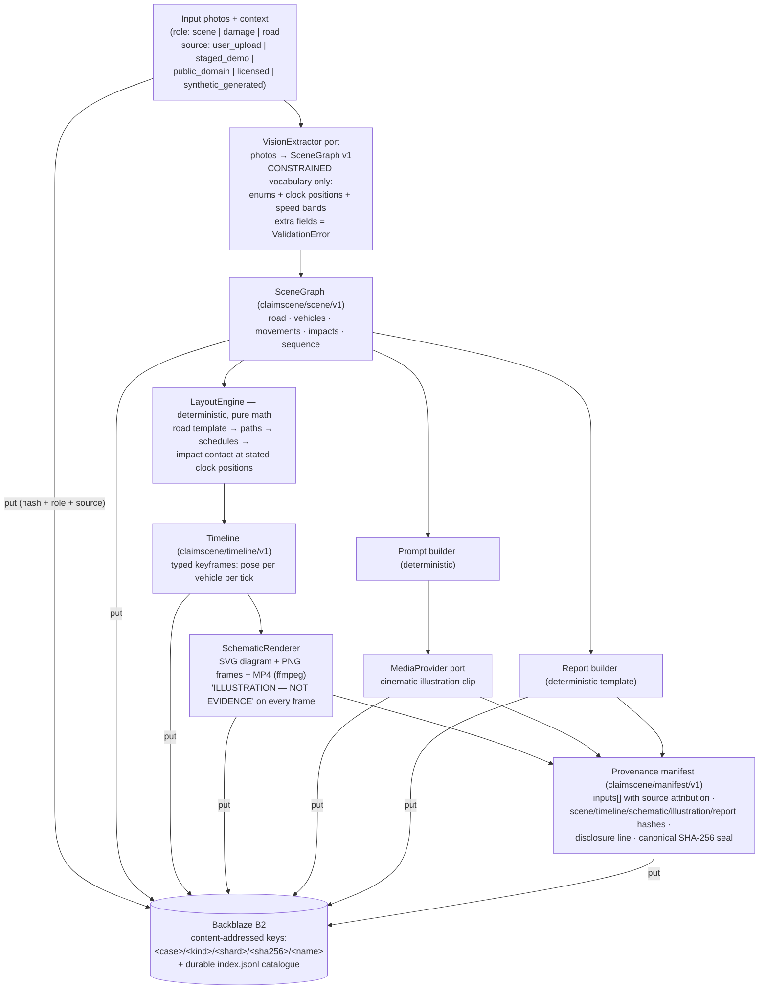
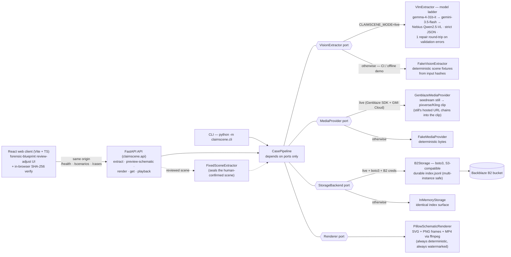

# ClaimScene

**Honest accident documentation & illustration.** Photos of an accident go in.
Out comes a constrained scene description, a deterministic top-down schematic,
a cinematic AI illustration that is explicitly sealed as *"AI-generated
illustration — not evidence"*, and an incident report. Every artifact is
content-addressed on Backblaze B2 with SHA-256-sealed provenance that also
records where every input photo came from.

A **forensic-blueprint web app** wraps the pipeline: the AI *proposes* a
constrained scene, you *review and adjust* it against a live-redrawing
schematic, and only then is the case sealed. AI proposes, you confirm — the
human-in-the-loop step is the centrepiece, and the whole flow runs on committed
sample scenarios so anyone can try it with zero photos.

Built for the **Backblaze Generative Media Hackathon** (provenance-aware media
category).

## The thesis

Incumbent accident-reconstruction tools sell precision they cannot prove.
ClaimScene sells the opposite: honest, self-disclosing illustration. As courts
and insurers tighten rules on AI-generated imagery in claims and evidence,
media that cannot say what it is becomes a liability. So ClaimScene splits
every case into two layers and never lets them blur:

1. **The factual layer.** A vision model may only fill a closed vocabulary
   (enums, clock positions, speed *bands* — never coordinates). Deterministic
   code turns that into geometry, an animated schematic, and a report. Same
   input, same bytes, every time.
2. **The illustration layer.** A generative establish-shot still plus a
   short video clip chained from it, both prompted in a deliberately
   non-photorealistic miniature-diorama register, watermarked in the prompt
   and sealed in the manifest as an illustration. The `degraded` flag
   honestly records whether a real provider generated them.

A tamper-evident manifest chains both layers, every input photo (with its
`source`, `attribution`, and `license`), and every hash. Re-badge a licensed
photo as a user upload and verification fails.

## Pipeline



## Architecture (ports and adapters)



The orchestrator depends only on ports. The fakes implement the same
protocols with no network, so the whole pipeline — including real SHA-256
provenance — runs offline in CI with zero credentials. In `live` mode a
missing credential degrades that backend to its fake with a WARNING and the
manifest honestly records `degraded: true`. It never crashes.

## The web app (review-adjust)

A React + Vite + TypeScript client in a deliberate **forensic-blueprint**
identity — dark steel drafting board, amber survey line-work, cyan technical
annotations, monospace throughout — served same-origin by the FastAPI backend
(one container, one port). A persistent top banner never lets the disclosure
out of sight: *"Illustrations are AI-generated — NOT EVIDENCE."*

The user journey is four steps, and the middle one is the whole point:

1. **Source.** Upload accident photos (per-photo role tagging), **or** pick one
   of the committed sample scenarios — so a reviewer can run the entire flow
   with zero photos of their own.
2. **Review & adjust — the centrepiece.** The extractor only *proposes* a
   scene. You edit it in a panel where every control is bound to the closed
   vocabulary — dropdowns for kind/colour/road/maneuver, a **12-position clock
   picker** for damage and impact points (never free-text coordinates). A
   static top-down schematic **redraws live** as you edit (`POST
   /cases/preview-schematic`). *AI proposes, you confirm* — nothing is sealed
   until you render.
3. **Render.** The full pipeline runs: animated schematic (factual layer) +
   disclosed illustration + report + a canonical-SHA-256 manifest, all stored.
   The seal also captures a **sealed AI→human approval receipt** — the exact
   proposed→confirmed scene diff and a `decision_digest` that self-voids if the
   confirmed scene ever drifts from what you approved (a demo click is honestly
   classified `interactive_demo`, never an authenticated approval).
4. **Sealed case.** The animated schematic plays beside the illustration clip
   (with a persistent *"AI ILLUSTRATION — NOT EVIDENCE"* overlay), next to the
   incident report, downloads, and a **provenance panel**: every input photo's
   source/attribution/licence, and a **Verify** button that recomputes the
   sealed SHA-256 in your browser (WebCrypto) from the re-fetched manifest.

Because the reviewed scene is client input, the API resets its
`confidence_notes` server-side before sealing (only server-derived text is
sealed), the constrained vocabulary is re-enforced by Pydantic (a hallucinated
field → `422`), and the schematic's dynamic text is XML-escaped at the source.

### HTTP API

| Route | Purpose |
|---|---|
| `GET /health` | liveness + effective backends (honest `mode`/`provider`/`storage`) |
| `GET /scenarios` | committed sample scenarios (zero-photo demo) |
| `POST /cases/extract` | photos or a scenario → a constrained SceneGraph |
| `POST /cases/preview-schematic` | a SceneGraph → a fast static schematic (live review) |
| `POST /cases/render` | a reviewed SceneGraph → a sealed case |
| `GET /cases/{id}` | the sealed manifest (raw canonical bytes, for in-browser verify) |
| `GET /cases/{id}/verify` | server-side re-verification from stored bytes (named-check receipt) |
| `GET /cases/{id}/receipt` | the detached, self-sealed receipt (raw canonical bytes) |
| `GET /cases/{id}/schematic` | factual-layer playback (MP4 live / PNG offline) |
| `GET /cases/{id}/illustration` | illustration playback (302 → fresh presigned URL live / stream offline) |

Every route works offline with zero credentials. A live media-provider failure
degrades **that request** to the offline provider against the same storage —
the response says so (`provider_degraded`) and the sealed manifest records the
provider that actually ran; it never 500s because a remote backend misbehaved.

### Run the web app locally

```bash
# 1. API (offline, no creds) — http://localhost:8000
pip install -e ".[server]"
uvicorn claimscene.api:app --reload

# 2. Web client (dev, proxies /health /scenarios /cases to :8000)
cd frontend && npm install && npm run dev        # http://localhost:5173
```

Or the whole thing as the single production container the deploy uses:

```bash
docker build -t claimscene .
docker run --rm -p 8000:8000 claimscene          # http://localhost:8000
```

The container boots in **offline** mode (health → `mode=offline`) with zero
credentials. See [`deploy/CLOUDRUN.md`](deploy/CLOUDRUN.md) for the turnkey
Cloud Run deploy (`bash deploy/deploy-cloudrun.sh`) and the live cutover.

## Quickstart (offline, no credentials, ~2 minutes)

```bash
git clone https://github.com/upgradedev/claimscene.git
cd claimscene
python -m venv .venv
# Windows: .venv\Scripts\activate    Linux/macOS: source .venv/bin/activate
pip install -r requirements-dev.txt
pip install -e ".[server]"      # [server] adds the API (fastapi + multipart)

pytest                          # 289 offline backend tests
python -m claimscene.cli --case demo --out out
```

The CLI generates three synthetic demo photos (no photo directory needed),
runs the full pipeline, writes `out/demo/` (scene.json, timeline.json,
schematic.svg, schematic.png, schematic.mp4 when ffmpeg is on PATH,
illustration.mp4, report.md, manifest.json, index.jsonl), and prints a
per-artifact SHA-256 verification ending in `VERIFY: PASS`.

To use your own staged photos: `python -m claimscene.cli --case demo
--photos <dir> --out out`. Filenames containing `damage` or `road` set the
photo role; `--source` records the provenance source for all loaded photos.

Score the repo against the judging criteria:

```bash
python scripts/readiness.py --min 0
```

## What the manifest seals

- `inputs[]` — SHA-256, media type, role, and **source attribution** per
  photo: `user_upload | staged_demo | public_domain | licensed |
  synthetic_generated`, plus optional `attribution` and `license` strings.
- `scene_graph`, `timeline`, `report` — hashes of the factual layer.
- `schematic` — SVG/PNG/MP4 hashes, frame count, and the watermark string.
- `illustration` — provider, clip model/prompt/hash, still
  model/prompt/hash, and the honest `degraded` flag.
- `disclosure` — the exact string `AI-generated illustration — not evidence`.
- `manifest_hash` — canonical-JSON SHA-256 over all of the above. Any edit,
  including re-badging an input's source, breaks verification.

## How Backblaze B2 is used

Every artifact is stored under a content-addressed key
`<case>/<kind>/<shard>/<sha256>/<name>` (kinds: `inputs`, `scene`,
`timeline`, `schematic`, `illustration`, `report`, `manifest`, `receipt`). The
adapter maintains a durable `index.jsonl` catalogue in the bucket itself, so a
fresh worker can resolve every case another instance sealed. Case ids and
filenames are sanitised before they touch a key; the SHA-256 anchor is
always machine-derived, so identity stays content-addressed even for
hostile input.

Alongside the manifest, each sealed case also writes a small **detached
receipt** (`receipt` kind) — its own object, `GET /cases/{id}/receipt`. It
distils the manifest hash, the Genblaze illustration output digest, and the
review decision digest into a self-sealed attestation whose own
`receipt_digest` recomputes, so a downstream reader can re-verify the case
(and bind those two cited digests back to the manifest) without re-fetching
every byte. *Honesty caveat:* the append-only `index.jsonl` proves an artifact
was **recorded**, not that it is **immutable** — pair the bucket with B2
Object Lock / object-versioning for true write-once tamper-evidence.

Environment contract (canonical Backblaze names primary, legacy aliases
accepted): `B2_BUCKET_NAME`, `B2_S3_ENDPOINT`, `B2_APPLICATION_KEY_ID`,
`B2_APPLICATION_KEY`, optional `B2_KEY_PREFIX`. See `.env.example`.

## AI providers and models used

| Stage | Live (`CLAIMSCENE_MODE=live`) | Offline (default, CI) |
|---|---|---|
| Scene extraction (VLM ladder) | GMI `google/gemma-4-31b-it` (primary) → GMI `google/gemini-3.5-flash` (fallback) → Nebius `Qwen/Qwen2.5-VL-72B-Instruct` (independent-provider fallback) | `FakeVisionExtractor` (deterministic fixtures) |
| Establish-shot still | `seedream-5.0-lite` via Genblaze + GMI Cloud | `FakeMediaProvider` (deterministic bytes) |
| Illustration clip (image-to-video from the still) | `pixverse-v6-i2v` (default) or `Kling-Image2Video-V2.1-Master` (premium) via Genblaze + GMI Cloud | `FakeMediaProvider` (deterministic bytes) |
| Schematic + layout + report | none — deterministic code by design | same code (no LLM anywhere) |

The ladder falls through on rate limits and transport errors (retry with
backoff first), and every reply must pass the constrained SceneGraph
validator; an invalid reply gets exactly one repair round-trip with the
validator's errors before the next rung takes over. The factual layer never
touches a generative model. That is the point.

## Measured extraction accuracy

The primary VLM (`google/gemma-4-31b-it`) scores **100% weighted
field accuracy** on the committed 7-scenario eval set (vehicle count, kind,
color, road layout, signal, approach, maneuver, damage and impact clock
positions within one hour). The fallback rung `google/gemini-3.5-flash`
also scored 100% on every scenario it actually answered, but GMI rate
limits (429) zeroed two of its seven scenarios during the run, so its
committed number is 71.4% — a capacity figure, not an accuracy one; the
failures are recorded in the scoreboard JSON. This is exactly why the
ladder exists and why gemma is the primary. The dated scoreboard lives in
`eval/results/` and the readiness gate fails the build if a committed
scoreboard ever drops below 60%.

How the eval works, and what it does not claim: each scenario in
`eval/scenarios/` is a staged toy-diorama photo set (three seedream-rendered
views kept consistent through reference-image chaining) plus a short
claimant-style context note. We authored the generation prompts and the
ground-truth SceneGraph together, so the set is self-consistent by
construction. That makes it a fair test of "can the extractor read a staged
scene into the constrained vocabulary", and nothing more. It is synthetic,
clean, and small; real phone photos of real accidents (glare, rain, night,
clutter, partial views) will score lower. Compass directions are resolvable
only because the context note supplies them, which mirrors the product's
actual input surface (photos plus the claimant's statement). Rerun it
yourself: `python scripts/eval_extraction.py --live` (a few cents of VLM
tokens; scenario regeneration via `scripts/generate_eval_scenarios.py` costs
about $0.74 at $0.035/image).

## Synthetic-data policy

No real accident photos, people, plates, or personal data enter this repo.
Demo inputs are synthetic images generated by the CLI (`source:
synthetic_generated`) or staged photos (`source: staged_demo`). The only
imagery committed here is the eval set and the live-illustration evidence:
seedream renders of toy dioramas, sealed as `synthetic_generated` with
their generation prompts in `eval/scenarios/manifest.json`. The
`.gitignore` blocks all other photo formats and a `private/` directory as a
belt-and-braces guard. Real deployments record real sources in the sealed
manifest instead of pretending they do not exist.

## Demo video

A narrated walkthrough lives at **`demo/claimscene-demo.mp4`** (about 2:25,
1920x1080 H.264, ElevenLabs voiceover with burned captions). It is assembled
beat by beat from `demo/claimscene-demo.beats.json`: each beat's line is
synthesized, the visual duration is locked to the measured audio, and a gentle
Ken Burns move pans across the committed forensic-blueprint cards in
`demo/assets/`. Rebuild it with `python scripts/build_video.py` (needs Pillow,
an `ffmpeg` on PATH, and `ELEVENLABS_API_KEY`); the exact caption timings are
written to `demo/claimscene-demo.en.srt`. CI runs `scripts/check_video.py`,
which re-verifies the committed mp4 against the beat script: under three
minutes, one video plus one audio stream, audio and video in sync to within a
frame, H.264/1080p, and one subtitle cue per beat in the scripted order. A
desynced or over-length video fails the build.

## Testing & CI

- **289 offline backend tests** (unit / integration / e2e): schema
  round-trips and rejection of hallucinated fields, layout determinism and
  contact-geometry properties, golden-file SVG, provenance seal/tamper, real
  B2 adapter against an S3 stub (**+ a presign contract test asserting SigV4 +
  region**, so the live playback redirect can't 401), VLM ladder + repair loop
  against canned transports, the extraction-accuracy scorer, Genblaze
  SDK-boundary contract tests, and the **full API chain** through FastAPI's
  TestClient (extract → preview → render → get → verify → playback, honest
  degrade, path sanitisation, 422s).
- **126 frontend tests** (Vitest): the review-panel edit logic, the
  schematic-preview live-update wiring, the ReviewStep centrepiece render, the
  **ExtractProgress** extract-latency UI, the playback-url selection, and the
  in-browser verify pinned to a **golden manifest produced by the real backend**
  (whose sealed em-dash exercises `ensure_ascii`).
- CI (GitHub Actions): gitleaks v8.18.4 secret scan first, then in parallel —
  a Python job (ruff, pytest, pip-audit, **readiness gate GATING at `--min
  95`** with a *Web Application* criterion driving the API via TestClient),
  a **frontend job** (typecheck → Vitest → production build), and a
  **real-browser end-to-end job** (Playwright/Chromium) that drives the built
  client through the whole source → review → render → sealed-case journey and
  gates accessibility (zero serious/critical axe violations) and responsive
  layout at 375/768/1280.
- ffmpeg tests skip cleanly when ffmpeg is absent (the schematic playback route
  then serves the real hero PNG instead of MP4); `@pytest.mark.live` smokes run
  only when `GMI_API_KEY` is present (never in CI).

## Shared foundation disclosure

ClaimScene shares an in-house B2 storage + provenance foundation (content-
addressed keys, durable `index.jsonl`, canonical-JSON SHA-256 sealing,
readiness-gate structure) with our other entry, **Cinemory** (MIT). The
domain — constrained scene vocabulary, deterministic layout engine,
schematic renderer, honest-media manifest — is new and specific to
ClaimScene.

## Repository layout

```
src/claimscene/
  scene.py          constrained vocabulary (SceneGraph v1) — the anti-hallucination core
  case.py           case inputs with per-photo source attribution
  layout.py         deterministic LayoutEngine → typed keyframe Timeline
  schematic.py      blueprint SVG + PNG frames + MP4 renderer (watermarked)
  report.py         deterministic report + self-disclosing illustration prompts
  provenance.py     manifest v1: build / seal / verify / per-artifact hashes
  evaluation.py     extraction-accuracy scorer (field rules + weighted aggregate)
  pipeline.py       CasePipeline orchestration (ports only)
  ports.py          VisionExtractor · MediaProvider · StorageBackend · Renderer
  keys.py           content-addressed storage keys (sanitised)
  config.py         mode + env resolution + degrade-to-fake wiring
  api.py            FastAPI web API (extract · preview · render · get · playback)
  scenarios.py      committed sample scenarios + safe image resolution
  cli.py            judge-runnable offline proof
  adapters/         fakes.py (offline) · b2_storage.py (real B2, boto3, SigV4) ·
                    vlm_extractor.py (live VLM ladder) ·
                    genblaze_provider.py (live still + clip)
frontend/           React + Vite + TS web client (forensic-blueprint UI)
  src/lib/          api.ts · scene.ts (constrained vocabulary) ·
                    provenance-verify.ts (in-browser WebCrypto verify)
  src/components/    review-adjust panel · ClockPicker · SchematicPreview ·
                    ProvenancePanel · steps/ · UI primitives
  src/test/fixtures/ golden-manifest.json (from the real backend)
deploy/             Dockerfile (root) · cloudbuild.yaml · deploy-cloudrun.sh · CLOUDRUN.md
eval/
  scenarios/        committed synthetic eval set (7 scenarios × 3 views + truths)
  results/          dated extraction-accuracy scoreboards (JSON + Markdown)
  evidence/         live-illustration proof, re-hashed by the readiness gate
scripts/
  readiness.py               seven-criteria readiness gate (real-evidence checks)
  eval_extraction.py         run the live ladder against the eval set
  generate_eval_scenarios.py regenerate the eval set (paid, run-once)
tests/              unit · integration · e2e (incl. test_api.py) · golden
```

## Roadmap

Done in Phase 2: the live VLM ladder behind `VisionExtractor` (measured on
the committed eval set), the `GenblazeMediaProvider` behind `MediaProvider`
(still + clip, SDK-contract-tested, live evidence committed under
`eval/evidence/`), and the readiness gate hardened to `--min 95`.

Done in Phase 3: the **FastAPI API** (extract · preview-schematic · render ·
get · verify · playback), the **forensic-blueprint React web app** with the
review-adjust centrepiece and in-browser provenance verification, the
**sealed AI→human approval receipt** (a server-computed proposed→confirmed
scene diff plus a recomputable `decision_digest` that self-voids if the
confirmed scene later drifts), the **`verify_all` named-check receipt**
(`GET /cases/{id}/verify`, re-running every seal/artifact/structural/review
check from primary evidence) and its **detached self-sealed receipt** written
as its own B2 object, the single-container **Dockerfile** + Cloud Run deploy
assets, the **B2 presign fix** (SigV4 + region), and a **Web Application**
readiness criterion.

Done (live, verified 2026-07-23): the container is **deployed to Cloud Run** at
a public URL, and the **`claimscene` B2 bucket** with a write-entitled, scoped
application key is provisioned. A live case render ran end to end against it
(`storage=B2Storage`), writing real objects — including a seedream establishing
still and a pixverse illustration clip — to the bucket.

Remaining (user-gated): the optional premium clip path
(`Kling-Image2Video-V2.1-Master`) exposed in the UI.

## License

MIT © 2026 upgradedev
